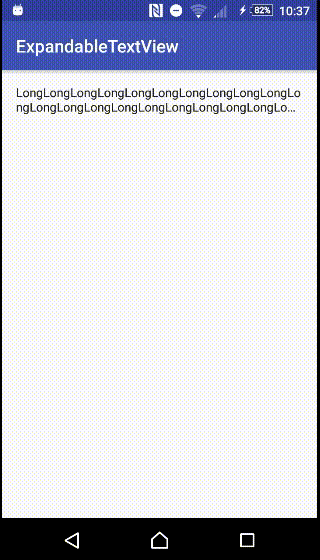

# ExpandableTextView
[](https://jitpack.io/#yuzumone/ExpandableTextView/)
[](https://www.apache.org/licenses/LICENSE-2.0.html)
[](https://travis-ci.org/yuzumone/ExpandableTextView)

ExpandableTextView is an android TextView library that performs multiline ellipsize.

## Demo


## Gradle
### Repository
Add this to your root `build.gradle` file.
```gradle
allprojects {
    repositories {
         ...
         maven { url 'https://jitpack.io' }
    }
}
```

### Dependency
Add this to your app `build.gradle` file.
```gradle
dependencies {
    ...
    implementation 'com.github.yuzumone:ExpandableTextView:0.3.0'
}
```

## Usage
### XML
```xml
<net.expandable.ExpandableTextView
    android:id="@+id/text"
    android:layout_width="wrap_content"
    android:layout_height="wrap_content"
    />
```

### Attributes
```xml
<net.expandable.ExpandableTextView
    app:expanded="false"
    app:expand_enabled="true"
    app:collapse_lines="1"
    />
```

## Expand
To set a state the TextView of ellipsize you use the setExpand functionality via xml or kotlin. Default value is false.

### XML
```xml
app:expanded="true"
or
app:expanded="false"
```

### Kotlin
```kotlin
textView.isExpanded = true
or
textView.isExpanded = false
```

## Expand_enabled
To set a state as to whether expand when clicking you use the setExpandEnabled functionality via xml or kotlin. Default value is true.

### XML
```xml
app:expand_enabled="true"
or
app:expand_enabled="false"
```

### Kotlin
```kotlin
textView.isExpandEnabled = true
or
textView.isExpandEnabled = false
```

## Collapse_lines
To set the number of lines when TextView ellipsize you use the setCollapseLines functionality via xml or kotlin. Default value is 1.

### XML
```xml
app:collapse_lines="1"
```

### Kotlin
```kotlin
textView.collapseLines = 1
```

## OnExpandableClickListener

```kotlin
textView.setOnExpandableClickListener(object : OnExpandableClickListener {
    override fun expand(view: ExpandableTextView) {
        // Expand action
    }

    override fun collapse(view: ExpandableTextView) {
       // Collapse action
    }
})
// OR
textView.setOnExpandableClickListener(
                onExpand = { // Expand action },
                onCollapse = { // Collapse action }
)
```

## License
```
Copyright 2017 yuzumone

Licensed under the Apache License, Version 2.0 (the "License");
you may not use this file except in compliance with the License.
You may obtain a copy of the License at

    http://www.apache.org/licenses/LICENSE-2.0

Unless required by applicable law or agreed to in writing, software
distributed under the License is distributed on an "AS IS" BASIS,
WITHOUT WARRANTIES OR CONDITIONS OF ANY KIND, either express or implied.
See the License for the specific language governing permissions and
limitations under the License.
```
